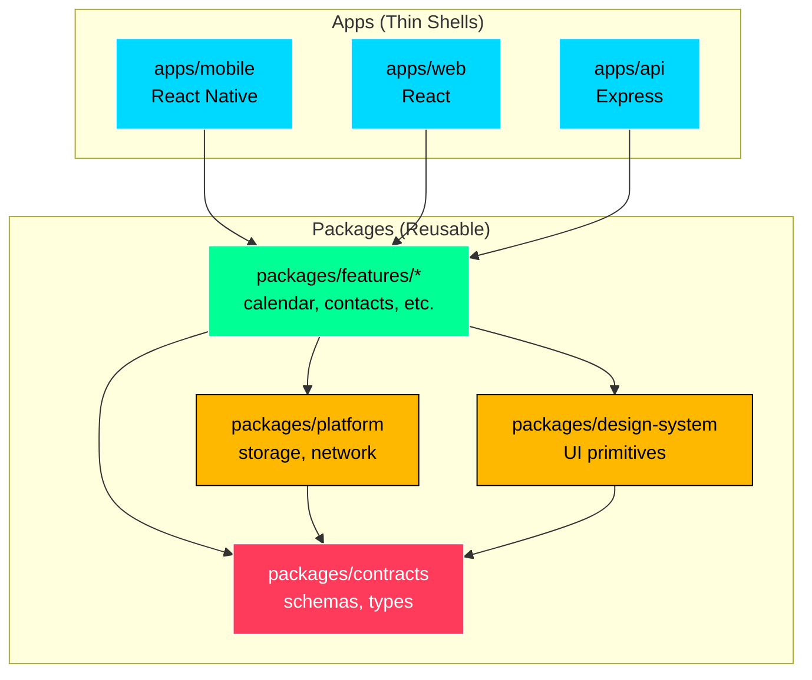
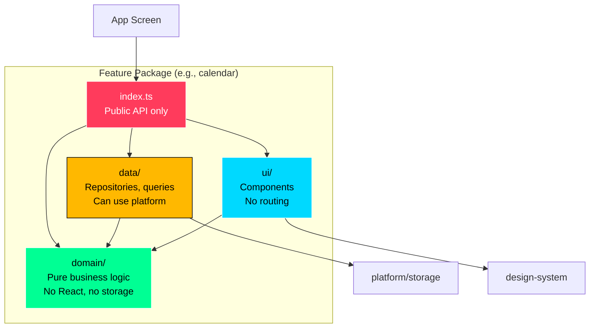
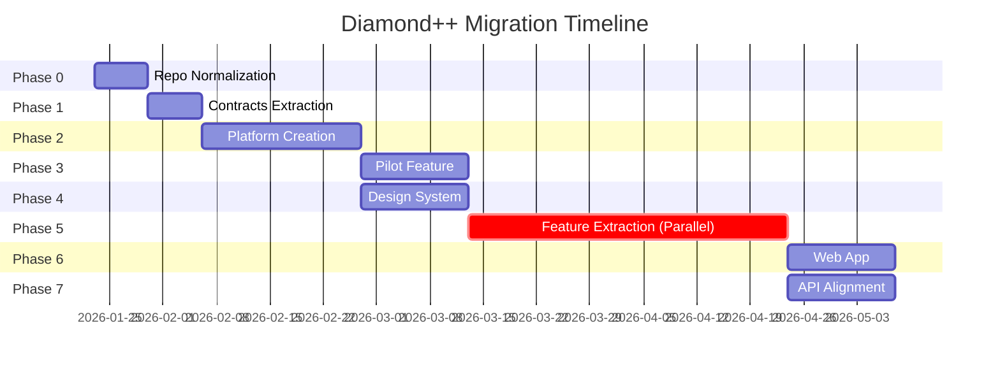
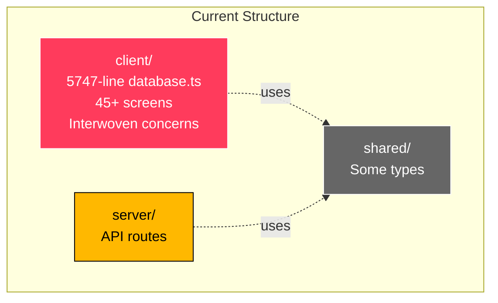
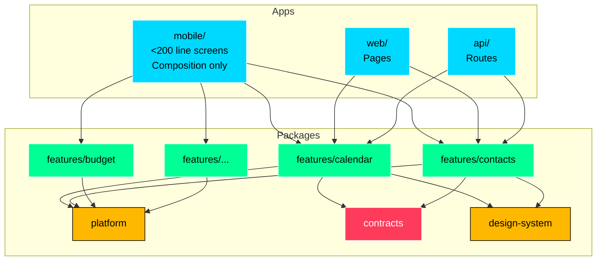
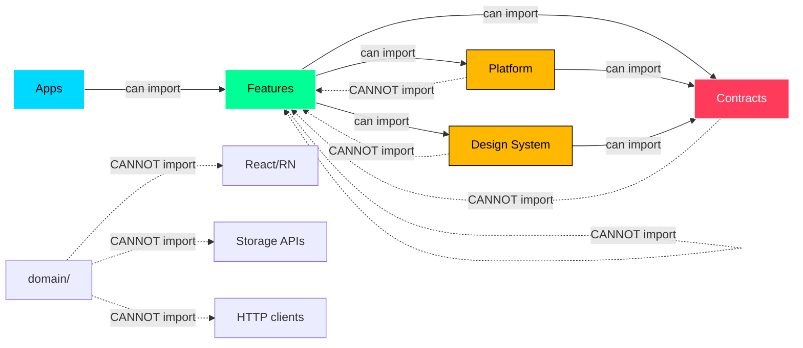
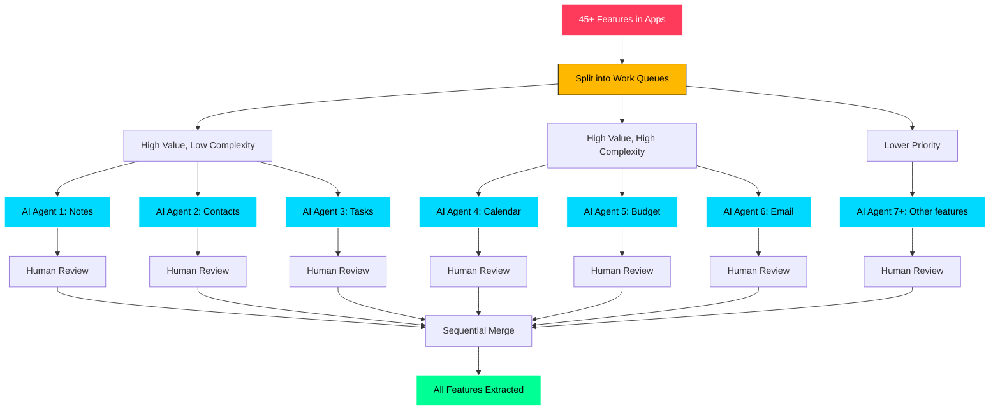

# Diamond++ Architecture Migration Diagrams

This document contains visual diagrams for the Diamond++ architecture migration.

## Target Architecture (End State)

## Feature Package Anatomy

## Migration Phases Timeline

## Current vs Target Structure

### Current (Before Migration)

### Target (After Migration)

## Dependency Flow Rules

## Phase 5: Parallel Feature Extraction

## Color Key

- **Electric Blue (#00D9FF):** Apps and UI components
- **Success Green (#00FF94):** Features and domain logic
- **Warning Yellow (#FFB800):** Platform and design system
- **Error Red (#FF3B5C):** Contracts and critical boundaries

---

**Related Documents:**
- [Diamond++ Migration Plan](./DIAMOND_PLUS_PLUS_MIGRATION_PLAN.md)
- [Diamond++ Quick Reference](./DIAMOND_QUICK_REFERENCE.md)
- [ADR-008](../decisions/008-diamond-architecture-migration.md)
