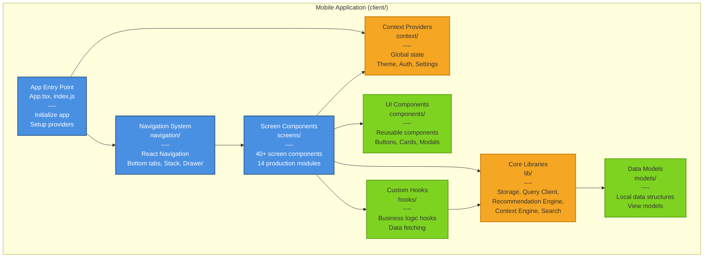

# C4 Model - Level 3: Component Diagram

## Plain English Summary

This diagram shows the internal structure of the mobile app and backend API—the moving parts inside each container. For the mobile app, we see components like Navigation, Screen Modules (Notebook, Planner, etc.), Storage Manager, and UI Components. For the backend, we see Authentication, API Routes, Storage Layer, and Middleware. Think of it as opening the hood of a car to see the engine, transmission, and other systems. Each component has a specific job, and they work together to make the application function.

## Technical Detail

### Mobile Application Components



### Backend API Components

```mermaid
graph TB
    subgraph "Backend API (server/)"
        ServerEntry[Server Entry Point<br/>index.ts<br/>----<br/>Initialize Express<br/>Setup middleware<br/>Start HTTP server]
        
        Routes[API Routes<br/>routes.ts<br/>----<br/>Endpoint definitions<br/>Request handlers<br/>Response formatting]
        
        Middleware[Middleware<br/>middleware/<br/>----<br/>Authentication (JWT)<br/>Validation (Zod)<br/>Error handling]
        
        Storage[Storage Layer<br/>storage.ts<br/>----<br/>Data access functions<br/>Drizzle ORM queries<br/>In-memory cache]
        
        ServerEntry --> Middleware
        ServerEntry --> Routes
        Routes --> Middleware
        Routes --> Storage
    end
    
    Database[(PostgreSQL<br/>Database)]
    SharedSchema[Shared Schema<br/>shared/schema.ts<br/>----<br/>Drizzle definitions<br/>TypeScript types<br/>Zod validators]
    
    Storage --> Database
    Routes -.->|Imports types| SharedSchema
    Storage -.->|Imports schema| SharedSchema
    
    style ServerEntry fill:#4A90E2,stroke:#2E5C8A,stroke-width:2px,color:#fff
    style Routes fill:#4A90E2,stroke:#2E5C8A,stroke-width:2px,color:#fff
    style Middleware fill:#F5A623,stroke:#C77E0A,stroke-width:2px
    style Storage fill:#F5A623,stroke:#C77E0A,stroke-width:2px
    style Database fill:#7ED321,stroke:#5FA319,stroke-width:3px,color:#fff
    style SharedSchema fill:#F5A623,stroke:#C77E0A,stroke-width:2px
```

### Component Details

---

## Mobile Application Components

### 1. App Entry Point

**Files:**
- `client/App.tsx` - Root React component
- `client/index.js` - Expo entry point

**Responsibilities:**
- Initialize Expo app
- Setup React Query provider
- Configure error boundaries
- Initialize AsyncStorage
- Register root navigator
- Handle splash screen
- Load fonts and assets

**Dependencies:**
- React Native
- Expo modules
- All context providers
- Navigation root

**Code Example:**
```typescript
// client/App.tsx (conceptual)
export default function App() {
  return (
    <QueryClientProvider client={queryClient}>
      <AuthProvider>
        <ThemeProvider>
          <SafeAreaProvider>
            <NavigationContainer>
              <RootNavigator />
            </NavigationContainer>
          </SafeAreaProvider>
        </ThemeProvider>
      </AuthProvider>
    </QueryClientProvider>
  );
}
```

### 2. Navigation System

**Files:**
- `client/navigation/AppNavigator.tsx` - Main app navigation (bottom tabs, drawer)
- `client/navigation/RootStackNavigator.tsx` - Root stack (auth, onboarding)

**Responsibilities:**
- Define navigation structure (tabs, stacks, drawer)
- Handle deep linking
- Manage navigation state
- Provide navigation context
- Implement authentication flow routing
- Handle back button behavior

**Navigation Structure:**
```
RootStack
├── Onboarding (for new users)
├── Auth (Login/Register)
└── MainApp
    ├── BottomTabs
    │   ├── CommandCenter
    │   ├── Notebook
    │   ├── Planner
    │   ├── Calendar
    │   └── More (Drawer)
    └── Modal Stacks
        ├── NoteEditor
        ├── TaskDetail
        ├── EventDetail
        └── Settings
```

**Key Navigation Patterns:**
- Stack navigation for hierarchical flows
- Bottom tabs for main modules
- Drawer for additional modules
- Modal presentation for editors and details

### 3. Screen Components

**Directory:** `client/screens/`

**Count:** 40+ screen components

**Production Modules (14):**
1. CommandCenter - Dashboard and overview
2. Notebook - Notes management
3. Planner - Tasks and projects
4. Calendar - Events scheduling
5. Email - Email management
6. Messages - Messaging threads
7. Lists - List management
8. Alerts - Notifications and alerts
9. Contacts - Contact management
10. Translator - Translation tools
11. Photos - Photo gallery
12. History - Activity history
13. Budget - Budget tracking
14. Integrations - External service integration

**Key Screens:**
```
client/screens/
├── CommandCenterScreen.tsx       # Dashboard
├── NotebookScreen.tsx            # Note list
├── NoteEditorScreen.tsx          # Note create/edit
├── PlannerScreen.tsx             # Task list
├── TaskDetailScreen.tsx          # Task view/edit
├── ProjectDetailScreen.tsx       # Project management
├── CalendarScreen.tsx            # Calendar view
├── EventDetailScreen.tsx         # Event details
├── EmailScreen.tsx               # Email inbox
├── MessagesScreen.tsx            # Message threads
├── ConversationDetailScreen.tsx  # Message detail
├── ListsScreen.tsx               # List overview
├── ListEditorScreen.tsx          # List editing
├── AlertsScreen.tsx              # Alert center
├── ContactsScreen.tsx            # Contact list
├── ContactDetailScreen.tsx       # Contact view
├── TranslatorScreen.tsx          # Translation interface
├── PhotosScreen.tsx              # Photo gallery
├── AlbumsScreen.tsx              # Album view
├── PhotoDetailScreen.tsx         # Photo viewer
├── PhotoEditorScreen.tsx         # Photo editing
├── HistoryScreen.tsx             # Activity log
├── BudgetScreen.tsx              # Budget overview
├── IntegrationsScreen.tsx        # Integration list
├── IntegrationDetailScreen.tsx   # Integration config
├── SettingsMenuScreen.tsx        # Settings hub
├── GeneralSettingsScreen.tsx     # General settings
├── PersonalizationScreen.tsx     # Theme, appearance
├── AIPreferencesScreen.tsx       # AI configuration
├── OnboardingWelcomeScreen.tsx   # First-time welcome
└── OnboardingModuleSelectionScreen.tsx  # Module selection
```

**Responsibilities:**
- Render UI for specific features
- Handle user interactions
- Fetch data via React Query
- Display loading/error states
- Navigate to related screens
- Implement module-specific logic

**Common Pattern:**
```typescript
export default function NotebookScreen({ navigation }) {
  const { data: notes, isLoading } = useQuery({
    queryKey: ['notes'],
    queryFn: fetchNotes,
  });

  if (isLoading) return <LoadingSpinner />;

  return (
    <View>
      <FlatList
        data={notes}
        renderItem={({ item }) => (
          <NoteCard
            note={item}
            onPress={() => navigation.navigate('NoteEditor', { id: item.id })}
          />
        )}
      />
    </View>
  );
}
```

### 4. Core Libraries

**Directory:** `client/lib/`

**Key Files:**

#### `storage.ts` - AsyncStorage Wrapper
- Abstract AsyncStorage operations
- Provide typed get/set functions
- Handle JSON serialization
- Manage cache keys
- JWT token storage

```typescript
// client/lib/storage.ts
export async function getAuthToken(): Promise<string | null> {
  return await AsyncStorage.getItem('@aios/auth/token');
}

export async function setAuthToken(token: string): Promise<void> {
  await AsyncStorage.setItem('@aios/auth/token', token);
}
```

#### `query-client.ts` - React Query Configuration
- Configure React Query client
- Set default options (stale time, cache time)
- Configure retry logic
- Setup offline behavior
- Add request interceptors (JWT)

#### `recommendationEngine.ts` - AI Recommendations
- Generate recommendations from user activity
- Calculate confidence scores
- Prioritize suggestions
- Manage recommendation lifecycle
- Integrate with attention center

#### `contextEngine.ts` - Cross-Module Context
- Track user context across modules
- Maintain activity history
- Enable smart handoffs
- Provide contextual suggestions

#### `searchIndex.ts` - Universal Search
- Index all user data for search
- Full-text search implementation
- Filter and rank results
- Support omnisearch feature

#### `moduleRegistry.ts` - Module Management
- Register all modules
- Manage module metadata
- Handle module enable/disable
- Support lazy loading

#### `attentionManager.ts` - Attention Center
- Aggregate alerts and notifications
- Prioritize items needing attention
- Track completion
- Clear resolved items

#### `eventBus.ts` - Event System
- Publish/subscribe event bus
- Inter-module communication
- Decouple components
- Handle cross-cutting concerns

### 5. UI Components

**Directory:** `client/components/`

**Responsibilities:**
- Reusable UI elements
- Consistent styling
- Common interaction patterns
- Accessibility support

**Common Components (examples):**
- `Button.tsx` - Styled buttons
- `Card.tsx` - Content cards
- `Modal.tsx` - Modal dialogs
- `Input.tsx` - Form inputs
- `List.tsx` - List views
- `Header.tsx` - Screen headers
- `TabBar.tsx` - Custom tab bar
- `Drawer.tsx` - Drawer menu
- `Spinner.tsx` - Loading indicators
- `EmptyState.tsx` - Empty state UI

### 6. Custom Hooks

**Directory:** `client/hooks/`

**Purpose:** Encapsulate reusable logic

**Common Hooks (examples):**
- `useAuth()` - Authentication state and actions
- `useNotes()` - Notes CRUD operations
- `useTasks()` - Tasks CRUD operations
- `useTheme()` - Theme access
- `useDebounce()` - Debounced values
- `useKeyboard()` - Keyboard events
- `usePersist()` - Persist state to AsyncStorage

### 7. Context Providers

**Directory:** `client/context/`

**Purpose:** Global state management

**Contexts:**
- `AuthContext` - User authentication state
- `ThemeContext` - Theme configuration
- `SettingsContext` - User preferences
- `ModuleContext` - Enabled modules

**Pattern:**
```typescript
// client/context/AuthContext.tsx
export const AuthContext = createContext<AuthContextType>(null);

export function AuthProvider({ children }) {
  const [user, setUser] = useState(null);
  const [token, setToken] = useState(null);

  const login = async (username, password) => { /* ... */ };
  const logout = async () => { /* ... */ };

  return (
    <AuthContext.Provider value={{ user, token, login, logout }}>
      {children}
    </AuthContext.Provider>
  );
}
```

### 8. Data Models

**Directory:** `client/models/`

**Purpose:**
- Local data structures
- View models for UI
- Transform server data
- Derive computed properties

---

## Backend API Components

### 1. Server Entry Point

**File:** `server/index.ts`

**Responsibilities:**
- Create Express app instance
- Configure middleware (JSON parsing, CORS)
- Register routes
- Setup error handlers
- Create HTTP server
- Start listening on port
- Handle graceful shutdown

**Code Structure:**
```typescript
// server/index.ts (simplified)
import express from 'express';
import { registerRoutes } from './routes';

const app = express();
app.use(express.json());

const server = await registerRoutes(app);

const PORT = process.env.PORT || 5000;
server.listen(PORT, () => {
  console.log(`Server running on port ${PORT}`);
});
```

### 2. API Routes

**File:** `server/routes.ts`

**Responsibilities:**
- Define all HTTP endpoints
- Handle requests and responses
- Call validation middleware
- Call authentication middleware
- Invoke storage layer functions
- Format JSON responses
- Handle errors

**Route Organization:**
```
Authentication:
  POST /api/auth/register
  POST /api/auth/login

Notes:
  GET    /api/notes
  POST   /api/notes
  GET    /api/notes/:id
  PUT    /api/notes/:id
  DELETE /api/notes/:id

Tasks:
  GET    /api/tasks
  POST   /api/tasks
  GET    /api/tasks/:id
  PUT    /api/tasks/:id
  DELETE /api/tasks/:id

Projects:
  GET    /api/projects
  POST   /api/projects
  GET    /api/projects/:id
  PUT    /api/projects/:id
  DELETE /api/projects/:id

Events:
  GET    /api/events
  POST   /api/events
  GET    /api/events/:id
  PUT    /api/events/:id
  DELETE /api/events/:id

Messages:
  GET    /api/conversations
  POST   /api/conversations
  GET    /api/conversations/:id
  GET    /api/conversations/:id/messages
  POST   /api/conversations/:id/messages
  GET    /api/messages/search

Settings:
  GET    /api/settings
  PUT    /api/settings

Recommendations:
  GET    /api/recommendations
  PUT    /api/recommendations/:id (dismiss, accept)

Health:
  GET    /status
```

**Route Pattern:**
```typescript
app.get('/api/notes',
  authenticate,
  asyncHandler(async (req, res) => {
    const userId = req.user!.id;
    const notes = await storage.getUserNotes(userId);
    res.json(notes);
  })
);

app.post('/api/notes',
  authenticate,
  validate(insertNoteSchema),
  asyncHandler(async (req, res) => {
    const userId = req.user!.id;
    const note = await storage.createNote({ ...req.body, userId });
    res.status(201).json(note);
  })
);
```

### 3. Middleware

**Directory:** `server/middleware/`

#### `auth.ts` - Authentication Middleware

**Responsibilities:**
- Generate JWT tokens
- Validate JWT tokens
- Extract user from token
- Attach user to request object
- Handle expired tokens

**Functions:**
```typescript
export function generateToken(userId: string): string {
  return jwt.sign({ userId }, SECRET, { expiresIn: '7d' });
}

export function authenticate(req, res, next) {
  const token = req.headers.authorization?.split(' ')[1];
  if (!token) return res.status(401).json({ error: 'No token' });

  try {
    const payload = jwt.verify(token, SECRET);
    req.user = { id: payload.userId };
    next();
  } catch {
    res.status(401).json({ error: 'Invalid token' });
  }
}
```

#### `validation.ts` - Request Validation

**Responsibilities:**
- Validate request body against Zod schema
- Validate URL parameters
- Validate query strings
- Return 400 errors for invalid input
- Provide detailed error messages

**Functions:**
```typescript
export function validate(schema: z.ZodSchema) {
  return (req, res, next) => {
    try {
      schema.parse(req.body);
      next();
    } catch (error) {
      res.status(400).json({ error: formatZodError(error) });
    }
  };
}

export function validateParams(schema: z.ZodSchema) { /* ... */ }
export function validateQuery(schema: z.ZodSchema) { /* ... */ }
```

#### `errorHandler.ts` - Error Handling

**Responsibilities:**
- Catch unhandled errors
- Log errors
- Format error responses
- Distinguish operational vs programmer errors
- Return appropriate status codes

**Classes & Functions:**
```typescript
export class AppError extends Error {
  constructor(public statusCode: number, message: string) {
    super(message);
  }
}

export function asyncHandler(fn) {
  return (req, res, next) => {
    Promise.resolve(fn(req, res, next)).catch(next);
  };
}

export function errorHandler(err, req, res, next) {
  if (err instanceof AppError) {
    return res.status(err.statusCode).json({ error: err.message });
  }
  console.error(err);
  res.status(500).json({ error: 'Internal server error' });
}
```

### 4. Storage Layer

**File:** `server/storage.ts`

**Responsibilities:**
- Abstract database operations
- Provide typed data access functions
- Execute Drizzle ORM queries
- Maintain in-memory cache (optional)
- Handle data transformations
- Filter all queries by userId

**Functions (examples):**
```typescript
// Notes
export async function getUserNotes(userId: string): Promise<Note[]>
export async function getNoteById(noteId: string, userId: string): Promise<Note | null>
export async function createNote(data: InsertNote): Promise<Note>
export async function updateNote(noteId: string, data: Partial<Note>, userId: string): Promise<Note>
export async function deleteNote(noteId: string, userId: string): Promise<void>

// Tasks
export async function getUserTasks(userId: string): Promise<Task[]>
export async function createTask(data: InsertTask): Promise<Task>
// ... etc

// Messages (with search)
export async function searchMessages(userId: string, query: string, limit?: number): Promise<Message[]>
```

**Database Interaction:**
```typescript
import { db } from './db';
import { notes } from '@shared/schema';
import { eq, and, desc } from 'drizzle-orm';

export async function getUserNotes(userId: string): Promise<Note[]> {
  return await db
    .select()
    .from(notes)
    .where(eq(notes.userId, userId))
    .orderBy(desc(notes.updatedAt));
}
```

### 5. Shared Schema

**File:** `shared/schema.ts`

**Used By:**
- Backend storage layer (imports table definitions)
- Backend routes (imports Zod validation schemas)
- Frontend types (imports TypeScript types)

**Contents:**
- Drizzle table definitions (`pgTable`)
- TypeScript type exports (inferred from tables)
- Zod validation schemas (generated from tables)
- Type inference helpers

**Example:**
```typescript
// Database table
export const notes = pgTable("notes", {
  id: varchar("id").primaryKey(),
  userId: varchar("user_id").notNull(),
  title: text("title").notNull(),
  bodyMarkdown: text("body_markdown").notNull(),
  tags: jsonb("tags").$type<string[]>().notNull(),
  links: jsonb("links").$type<string[]>().notNull(),
  createdAt: timestamp("created_at").defaultNow().notNull(),
  updatedAt: timestamp("updated_at").defaultNow().notNull(),
});

// TypeScript types
export type Note = typeof notes.$inferSelect;
export type InsertNote = typeof notes.$inferInsert;

// Zod validation schemas
export const insertNoteSchema = createInsertSchema(notes).omit({
  id: true,
  userId: true,
  createdAt: true,
  updatedAt: true,
});

export const updateNoteSchema = insertNoteSchema.partial();
```

## Component Interaction Flows

### Create Note Flow

1. User taps "New Note" in `NotebookScreen`
2. Navigation navigates to `NoteEditorScreen`
3. User enters title and content
4. User taps "Save"
5. `NoteEditorScreen` calls `useMutation` from React Query
6. Mutation makes HTTP POST to `/api/notes`
7. Request includes JWT token from `storage.getAuthToken()`
8. Backend `authenticate` middleware validates JWT
9. Backend `validate(insertNoteSchema)` middleware validates body
10. Route handler calls `storage.createNote()`
11. Storage layer inserts into PostgreSQL via Drizzle
12. Response returns created note
13. React Query invalidates `['notes']` cache
14. `NotebookScreen` refetches notes
15. New note appears in list

### Search Messages Flow

1. User types in search box in `MessagesScreen`
2. `useDebounce` hook delays API call
3. After debounce, `useQuery` makes GET to `/api/messages/search?q=...`
4. Backend `authenticate` middleware validates JWT
5. Backend `validateQuery` checks query parameter
6. Route handler calls `storage.searchMessages(userId, query)`
7. Storage performs full-text search in database
8. Results filtered by userId
9. Response returns matching messages
10. UI displays results with highlights

### Recommendation Flow

1. Background task in `recommendationEngine.ts` runs
2. Engine analyzes user activity (overdue tasks, calendar conflicts, etc.)
3. Engine generates recommendations
4. Recommendations stored locally in AsyncStorage
5. User opens `CommandCenterScreen`
6. Screen displays recommendations from cache
7. User taps "View Details"
8. Navigation to relevant module with context
9. User accepts/dismisses recommendation
10. Update synced to backend (if online)

## Assumptions

1. **Component isolation**: Each component has clear boundaries and responsibilities
2. **Unidirectional data flow**: Data flows down via props, events bubble up
3. **React Query for server state**: All server data fetched via React Query hooks
4. **Context for global client state**: Authentication, theme, settings in React Context
5. **Middleware composition**: Express middleware compose cleanly without side effects
6. **Storage layer abstraction**: Routes never directly query database, always use storage layer
7. **User isolation in storage**: Every storage function filters by userId
8. **Shared schema as contract**: Client and server agree on data structure via shared/schema.ts

## Failure Modes

### Component Memory Leak

**Problem**: Screen components don't clean up subscriptions or timers.

**Impact:**
- App slows down over time
- Increased memory usage
- Eventual crash

**Mitigation:**
- Use React hooks cleanup (`useEffect` return function)
- Unsubscribe from event bus on unmount
- Cancel pending promises on unmount

### Navigation Stack Overflow

**Problem**: Deep navigation nesting or circular navigation.

**Impact:**
- Cannot go back
- Memory pressure from many mounted screens
- Confusing UX

**Mitigation:**
- Use modal presentation for editors
- Reset navigation stack after certain actions
- Limit stack depth

### Storage Layer N+1 Queries

**Problem**: Loading related data triggers multiple database queries.

**Impact:**
- Slow API responses
- Database load increases
- Poor user experience

**Mitigation:**
- Use Drizzle's join capabilities
- Batch requests where possible
- Add caching for frequently accessed data

### Middleware Order Issues

**Problem**: Middleware applied in wrong order (e.g., validation before auth).

**Impact:**
- Security vulnerabilities
- Confusing error messages
- Unexpected behavior

**Mitigation:**
- Document middleware order requirements
- Use naming conventions to clarify order
- Test middleware composition

### Schema Drift

**Problem**: Client and server diverge on data structure.

**Impact:**
- Type errors at runtime
- Data corruption
- Validation failures

**Mitigation:**
- Single source of truth in shared/schema.ts
- TypeScript compilation catches mismatches
- Integration tests verify contract

## How to Verify

### Mobile App Components

```bash
# 1. Verify all component directories exist
ls -d client/{screens,components,lib,hooks,context,navigation,models}

# 2. Count screens (should be 40+)
ls client/screens/*.tsx | wc -l

# 3. Check core libraries exist
ls client/lib/*.ts

# 4. Verify navigation files
ls client/navigation/*.tsx

# 5. Check for context providers
grep -r "createContext" client/context/

# 6. Verify hooks directory
ls client/hooks/

# 7. Test import paths work
npm run check:types
```

### Backend API Components

```bash
# 1. Verify server structure
ls server/{index.ts,routes.ts,storage.ts}

# 2. Check middleware exists
ls server/middleware/{auth.ts,validation.ts,errorHandler.ts}

# 3. Count API routes
grep -E "app\.(get|post|put|delete)" server/routes.ts | wc -l

# 4. Verify storage functions
grep "export async function" server/storage.ts | wc -l

# 5. Check shared schema imports
grep "from '@shared/schema'" server/routes.ts
grep "from '@shared/schema'" server/storage.ts
```

### Component Interactions

```bash
# 1. Screen → Library calls
grep -r "import.*from.*lib" client/screens/ | head -10

# 2. Screen → Hook calls
grep -r "use[A-Z]" client/screens/*.tsx | grep "=" | head -10

# 3. Route → Middleware usage
grep "authenticate" server/routes.ts | wc -l
grep "validate" server/routes.ts | wc -l

# 4. Route → Storage calls
grep "storage\." server/routes.ts | head -10

# 5. Storage → Database queries
grep "db\." server/storage.ts | head -10
```

### Type Safety Across Components

```bash
# 1. Verify TypeScript compiles
npm run check:types

# 2. Check client imports shared types
grep "import.*from '@shared/schema'" client/screens/*.tsx | wc -l

# 3. Check server imports shared types
grep "import.*from '@shared/schema'" server/*.ts | wc -l

# 4. Verify Zod schema usage
grep "Schema" server/routes.ts | head -10
```

### Component Tests

```bash
# 1. Run all tests
npm test

# 2. Run client tests (if separated)
npm test -- client/

# 3. Run server tests
npm test -- server/

# 4. Check test coverage
npm run test:coverage
```

## Related Documentation

- [System Context](./system_context.md) - System-level overview
- [Container Diagram](./container.md) - Container-level architecture
- [Deployment Diagram](./deployment.md) - Runtime deployment
- [C4 Overview](./README.md) - How to read C4 diagrams
- [Module Details](/MODULE_DETAILS.md) - Detailed module specifications
- [client/lib/README.md](/client/lib/README.md) - Core library documentation (if exists)
- [server/README.md](/server/README.md) - Server documentation (if exists)

## References

- React Component Design: https://react.dev/learn/thinking-in-react
- Express Middleware: https://expressjs.com/en/guide/using-middleware.html
- React Query Architecture: https://tanstack.com/query/latest/docs/react/overview
- Drizzle ORM: https://orm.drizzle.team/docs/overview
