# Deployment Architecture

## Overview

AIOS supports multiple deployment environments with automated CI/CD pipelines. This document outlines the deployment architecture for development, staging, and production environments.

## Environment Architecture

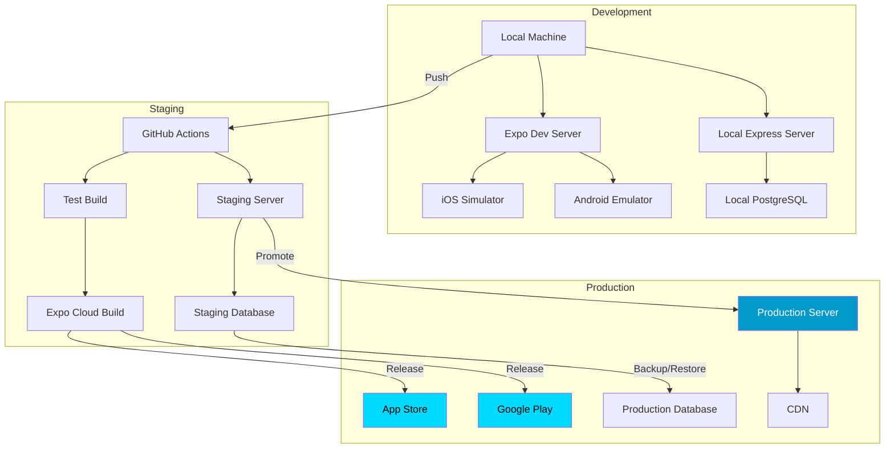

## Development Environment

### Local Setup

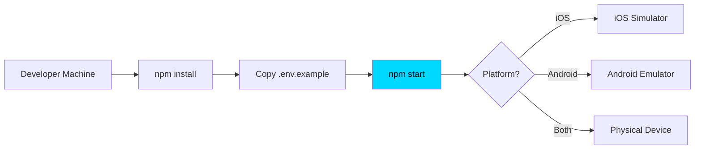

**Components:**

- **Node.js:** 18+
- **Expo CLI:** 54
- **iOS Simulator:** Xcode required (Mac only)
- **Android Emulator:** Android Studio
- **Express Server:** Local instance on port 5000
- **PostgreSQL:** Optional, for testing server features

**Environment Variables:**

```
NODE_ENV=development
EXPO_PUBLIC_DOMAIN=localhost:5000
API_URL=http://localhost:5000
DB_URL=postgresql://localhost:5432/aios_dev
JWT_SECRET=dev-secret-key
```

## Staging Environment

### CI/CD Pipeline

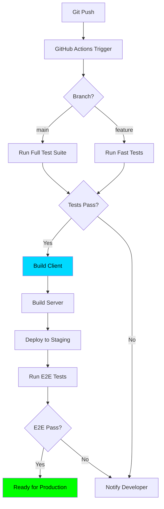

**Components:**

- **CI/CD:** GitHub Actions
- **Build:** Expo EAS Build
- **Server:** Cloud hosting (e.g., Railway, Render)
- **Database:** Managed PostgreSQL
- **Monitoring:** Error tracking, performance monitoring

**Environment Variables:**

```
NODE_ENV=staging
EXPO_PUBLIC_DOMAIN=staging.aios.app
API_URL=https://api-staging.aios.app
DB_URL=postgresql://staging-db-url
JWT_SECRET=staging-secret-key
```

## Production Environment

### Infrastructure

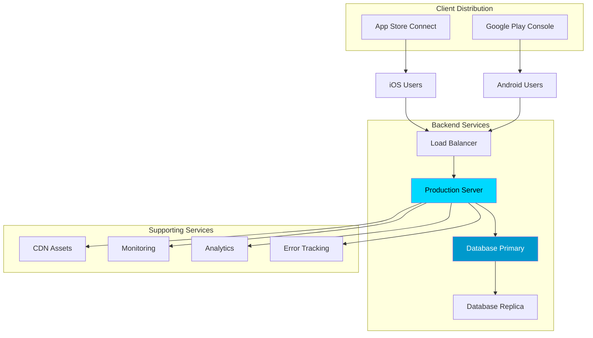

**Components:**

- **Client Apps:** Distributed via App Store and Google Play
- **API Server:** High-availability Express cluster
- **Database:** PostgreSQL with replication
- **CDN:** Static asset delivery
- **Monitoring:** Uptime, performance, errors
- **Analytics:** User behavior tracking (privacy-respecting)

**Environment Variables:**

```
NODE_ENV=production
EXPO_PUBLIC_DOMAIN=aios.app
API_URL=https://api.aios.app
DB_URL=postgresql://production-db-url
JWT_SECRET=production-secret-key
```

## Deployment Workflows

### Feature Deployment

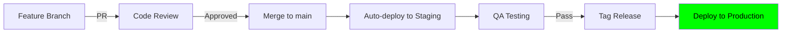

### Hotfix Deployment

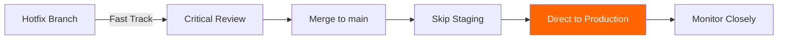

## Mobile App Updates

### Over-The-Air (OTA) Updates

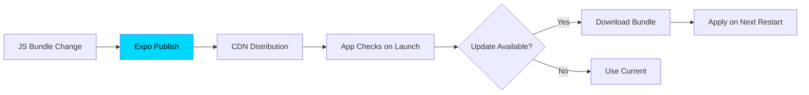

**What can be updated via OTA:**

- JavaScript code
- React components
- Business logic
- Styling and assets

**What requires native build:**

- Native dependencies
- Expo SDK version
- App permissions
- iOS/Android configurations

### Native App Updates

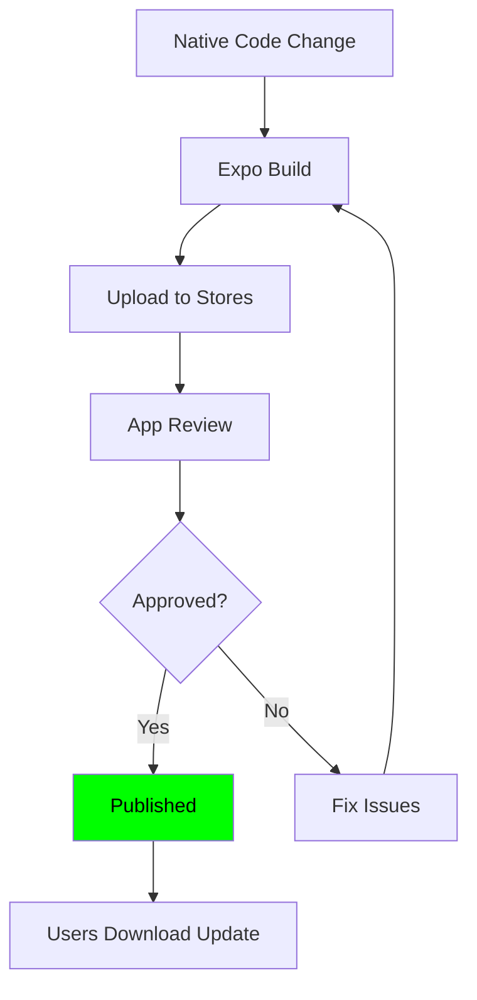

## Build Process

### Client Build

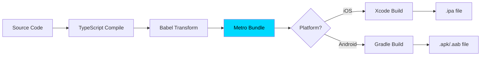

**Build Commands:**

```bash
# Development build
npm run start

# Production build
npm run expo:static:build

# Platform-specific
npx expo build:ios
npx expo build:android
```

### Server Build

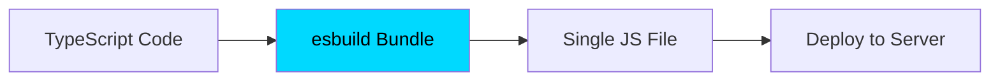

**Build Commands:**

```bash
# Build server
npm run server:build

# Run production
npm run server:prod
```

## Database Migrations

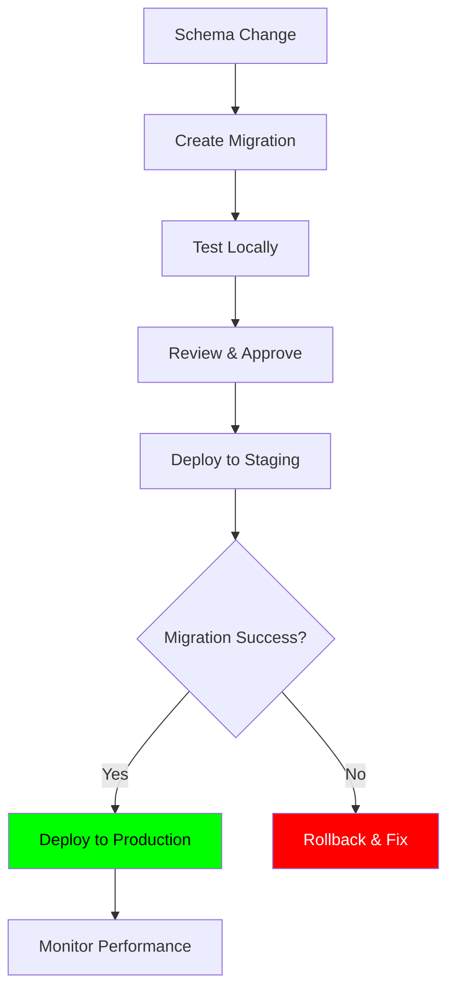

**Migration Commands:**

```bash
# Generate migration
npm run db:generate

# Push to database
npm run db:push

# Rollback (manual SQL)
psql -d $DB_URL -f rollback.sql
```

## Monitoring & Observability

### Health Check Flow

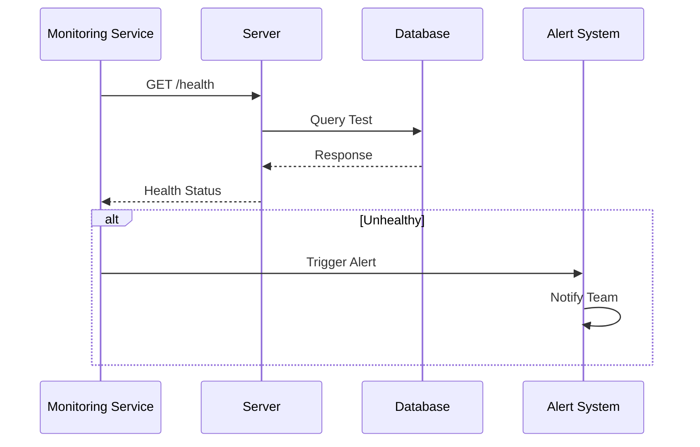

**Monitoring Metrics:**

- **Uptime:** 99.9% target
- **Response Time:** < 200ms p95
- **Error Rate:** < 0.1%
- **Database Queries:** < 50ms average
- **Memory Usage:** < 80% capacity
- **CPU Usage:** < 70% average

## Security Considerations

### Production Security Layers

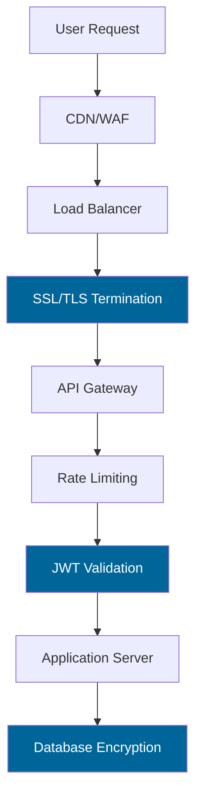

**Security Measures:**

- HTTPS enforced (TLS 1.3)
- JWT token authentication
- Rate limiting (100 req/min per IP)
- Database encryption at rest
- Regular security audits (CodeQL)
- Dependency vulnerability scanning
- OWASP Top 10 compliance

## Disaster Recovery

### Backup Strategy

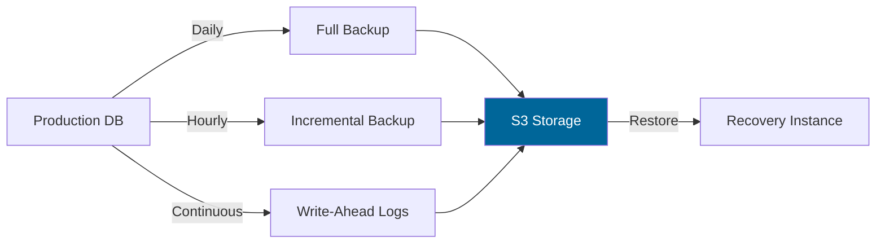

**Recovery Time Objectives:**

- **RPO (Recovery Point Objective):** < 1 hour
- **RTO (Recovery Time Objective):** < 4 hours
- **Backup Retention:** 30 days
- **Geo-Redundancy:** Multi-region backups

## Rollback Strategy

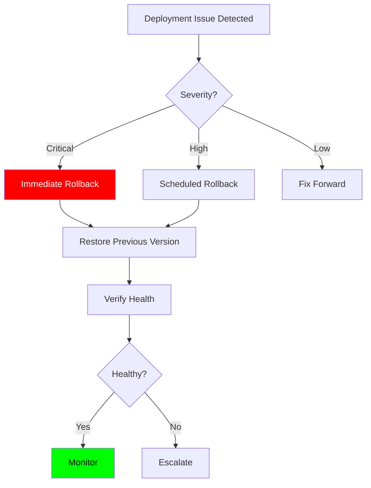

## Environment Comparison

| Aspect          | Development    | Staging            | Production          |
|-----------------|----------------|--------------------|--------------------|
| Database        | Local/Mock      | Cloud DB            | Replicated DB       |
| Server          | localhost:5000  | staging.aios.app    | aios.app            |
| Monitoring      | Console logs    | Basic monitoring    | Full observability  |
| Error Tracking  | Local only      | Sentry staging      | Sentry production   |
| Analytics       | Disabled        | Sample rate 10%     | Full tracking       |
| Cache           | Memory only     | Redis (optional)    | Redis + CDN         |
| Backups         | None            | Daily               | Continuous          |
| SSL             | Not required    | Required            | Required            |
| Rate Limiting   | Disabled        | Relaxed             | Enforced            |
| Auto-scaling    | No              | No                  | Yes                 |

## Deployment Checklist

### Pre-Deployment

- [ ] All tests passing
- [ ] Code review approved
- [ ] Documentation updated
- [ ] Environment variables configured
- [ ] Database migrations ready
- [ ] Rollback plan documented

### Deployment

- [ ] Deploy to staging first
- [ ] Run smoke tests
- [ ] Check monitoring dashboards
- [ ] Verify feature functionality
- [ ] Load test if major changes

### Post-Deployment

- [ ] Monitor error rates
- [ ] Check performance metrics
- [ ] Verify analytics events
- [ ] Update changelog
- [ ] Notify stakeholders

## Related Documents

- [System Architecture](./system-architecture.md)
- [CI/CD Configuration](../../../.github/workflows/)
- [Testing Instructions](../../technical/TESTING_INSTRUCTIONS.md)
