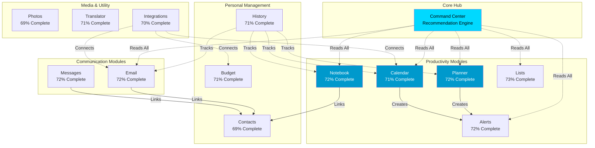
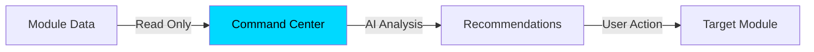
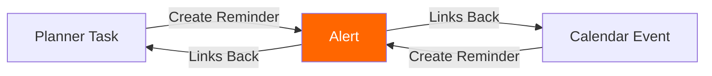
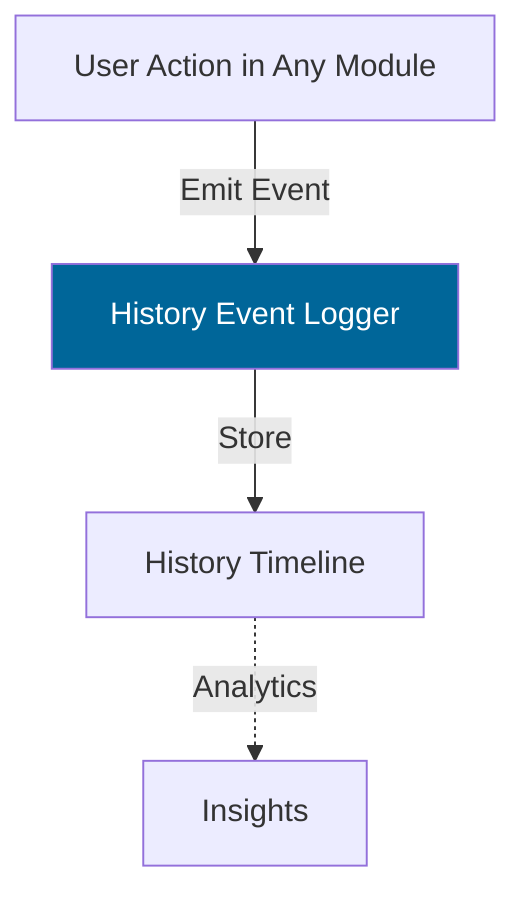
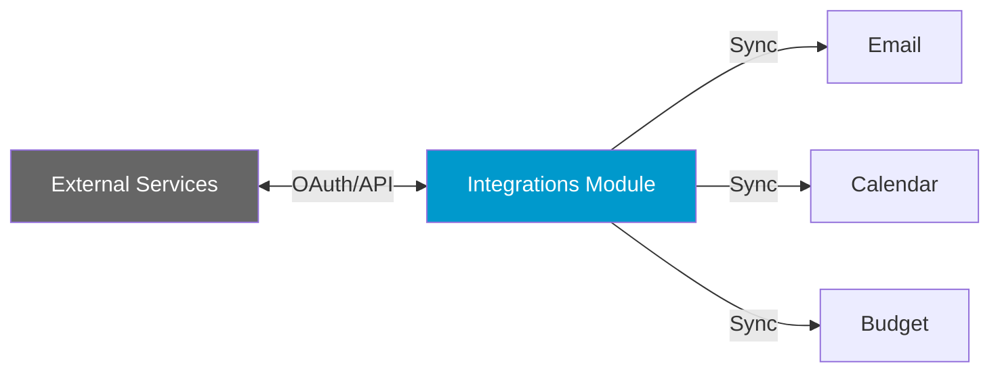
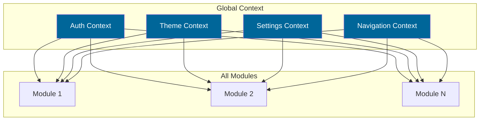
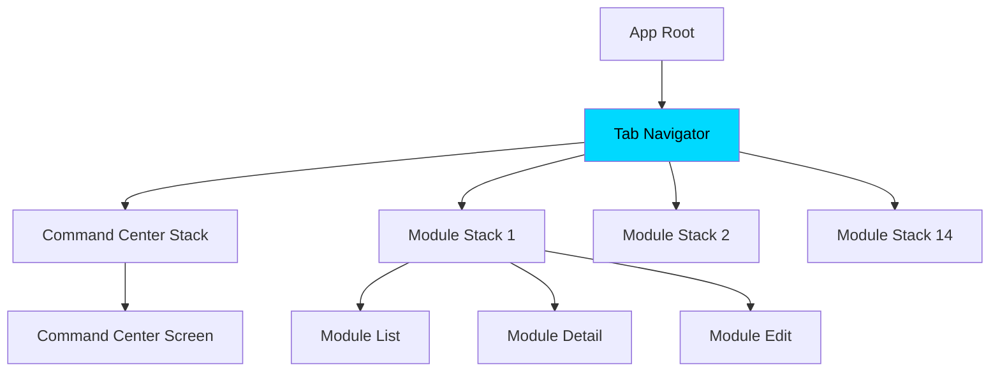
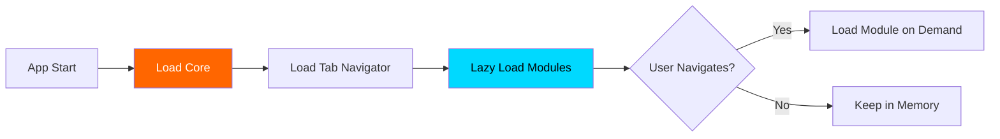

# Module Relationships

## Overview

AIOS consists of 14 production-ready modules with complex interdependencies. This document maps how modules interact, share data, and communicate.

## Module Dependency Graph



## Data Sharing Patterns

### Pattern 1: Central Hub (Command Center)

The Command Center reads from all modules but doesn't write back. It's a pure consumer.



**Modules Feeding Command Center:**

- Notebook → Recent notes, tags
- Planner → Active tasks, priorities
- Calendar → Upcoming events
- Email → Unread count, important threads
- Alerts → Pending notifications
- Lists → Incomplete items

### Pattern 2: Reference Linking (Contacts)

Contacts is referenced by communication modules but doesn't reference back.

```mermaid
graph TB
    A[Contacts Database] --> B[Email Module]
    A --> C[Messages Module]
    A --> D[Notebook Module]
    
    B -->|Display Name| B
    C -->|Display Name| C
    D -->|@mentions| D
    
    style A fill:#006699,color:#fff
```

### Pattern 3: Cross-Module Creation (Alerts)

Planner and Calendar can create Alerts, establishing a parent-child relationship.



### Pattern 4: Passive Tracking (History)

History tracks activity across modules without interfering.



### Pattern 5: External Integration (Integrations)

Integrations module bridges AIOS with external services.



## Module Communication Matrix

| From/To         | CC | NB | PL  | CAL | EM  | MSG | LST | AL  | CT  | TR  | PH  | HIS | BUD | INT |
|-----------------|----|----|-----|-----|-----|-----|-----|-----|-----|-----|-----|-----|-----|-----|
| **Command Center**   | -  | ✅ | ✅  | ✅  | ✅  | ✅  | ✅  | ✅  | ✅  | ❌  | ❌  | ✅  | ✅  | ❌  |
| **Notebook**         | ❌ | -  | ❌  | ❌  | ❌  | ❌  | ❌  | ❌  | 🔗  | ❌  | ❌  | ❌  | ❌  | ❌  |
| **Planner**          | ❌ | ❌ | -   | ❌  | ❌  | ❌  | ❌  | ✅  | ❌  | ❌  | ❌  | ❌  | ❌  | ❌  |
| **Calendar**         | ❌ | ❌ | ❌  | -   | ❌  | ❌  | ❌  | ✅  | ❌  | ❌  | ❌  | ❌  | ❌  | 🔗  |
| **Email**            | ❌ | ❌ | ❌  | ❌  | -   | ❌  | ❌  | ❌  | 🔗  | ❌  | ❌  | ❌  | ❌  | 🔗  |
| **Messages**         | ❌ | ❌ | ❌  | ❌  | ❌  | -   | ❌  | ❌  | 🔗  | ❌  | ❌  | ❌  | ❌  | ❌  |
| **Lists**            | ❌ | ❌ | ❌  | ❌  | ❌  | ❌  | -   | ❌  | ❌  | ❌  | ❌  | ❌  | ❌  | ❌  |
| **Alerts**           | ❌ | ❌ | 🔗  | 🔗  | ❌  | ❌  | ❌  | -   | ❌  | ❌  | ❌  | ❌  | ❌  | ❌  |
| **Contacts**         | ❌ | ❌ | ❌  | ❌  | ❌  | ❌  | ❌  | ❌  | -   | ❌  | ❌  | ❌  | ❌  | ❌  |
| **Translator**       | ❌ | ❌ | ❌  | ❌  | ❌  | ❌  | ❌  | ❌  | ❌  | -   | ❌  | ❌  | ❌  | ❌  |
| **Photos**           | ❌ | ❌ | ❌  | ❌  | ❌  | ❌  | ❌  | ❌  | ❌  | ❌  | -   | ❌  | ❌  | ❌  |
| **History**          | ❌ | ✅ | ✅  | ✅  | ✅  | ✅  | ✅  | ✅  | ✅  | ✅  | ✅  | -   | ✅  | ✅  |
| **Budget**           | ❌ | ❌ | ❌  | ❌  | ❌  | ❌  | ❌  | ❌  | ❌  | ❌  | ❌  | ❌  | -   | 🔗  |
| **Integrations**     | ❌ | ❌ | ❌  | 🔗  | 🔗  | ❌  | ❌  | ❌  | ❌  | ❌  | ❌  | ❌  | 🔗  | -   |

**Legend:**

- ✅ = Reads data from target module
- 🔗 = References entities in target module
- ❌ = No direct interaction

## Shared Services & Utilities

### Global Context



### Shared Utilities

All modules have access to:

- **Storage API:** Unified AsyncStorage wrapper
- **Analytics:** Event tracking
- **Haptics:** Tactile feedback
- **Toast/Alerts:** User notifications
- **Navigation:** Deep linking and navigation helpers
- **Validation:** Common form validators
- **Date/Time:** Formatting utilities

## Navigation Hierarchy



## Module Independence Levels

### Level 1: Fully Independent

No dependencies on other modules.

- Translator
- Photos
- Lists

### Level 2: Reference Only

References shared resources but doesn't read module data.

- Notebook (references Contacts)
- Email (references Contacts)
- Messages (references Contacts)
- Budget

### Level 3: Read Dependencies

Reads data from other modules.

- Command Center (reads all)
- History (tracks all)

### Level 4: Bidirectional

Creates or modifies data in other modules.

- Planner (creates Alerts)
- Calendar (creates Alerts)
- Integrations (syncs with Email, Calendar, Budget)

## Module Loading Strategy



## Future Module Extensions

Planned additions that will integrate with existing modules:

- **Wallet** → Integrates with Budget, Email (receipts), Calendar (bills)
- **Maps** → Integrates with Calendar (event locations), Contacts (addresses)
- **Food** → Integrates with Budget, Calendar, Lists
- **Health** → Integrates with Calendar, Planner, History

## Design Principles

1. **Loose Coupling:** Modules should work independently
2. **Read-Only Cross-Module:** Avoid circular dependencies
3. **Event-Driven:** Use events for cross-module communication
4. **Shared Context:** Use global state sparingly
5. **Data Ownership:** Each module owns its data exclusively

## Related Documents

- [System Architecture](./system-architecture.md)
- [Data Flow](./data-flow.md)
- [Module Details](../../../MODULE_DETAILS.md)
